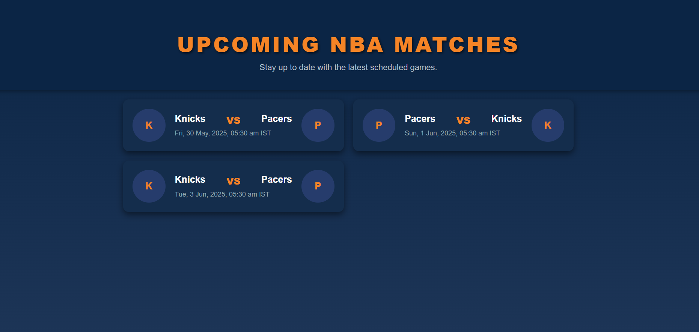

# Upcoming NBA Matches

A modern web app that displays upcoming NBA games for the next 20 days, showing teams and scheduled start times in Eastern Time.  
Built with **React** frontend and **FastAPI** backend using the official NBA API (`nba_api` package).

---

## Features

- Fetches live NBA schedule data for the next 20 days.  
- Displays team names and abbreviations in a clean, responsive UI.  
- Shows game start date and time formatted to Eastern Time zone.  
- Full screen, mobile-friendly React interface with smooth hover effects.  
- FastAPI backend serving the data with CORS enabled for frontend integration.  

---

## Demo

  

---

## Tech Stack

| Layer    | Technology                 |
| -------- | --------------------------|
| Frontend | React, JavaScript, CSS    |
| Backend  | FastAPI, Python, nba_api  |
| Hosting  | (Optional) GitHub Pages / Heroku / Any |

---

